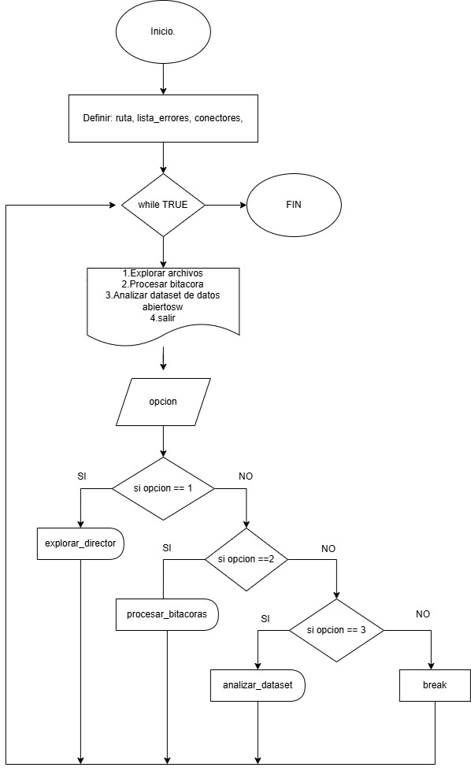
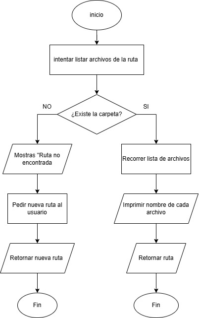
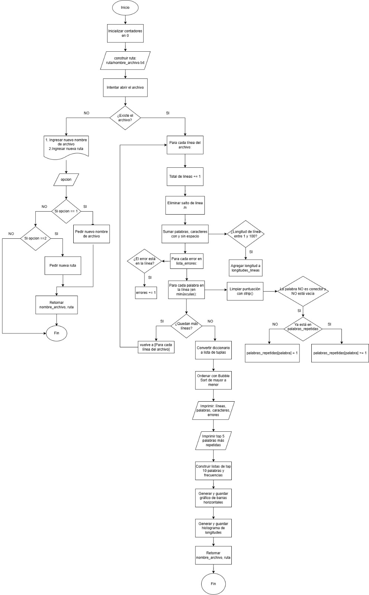

# Documento de Análisis:  

Este documento README contiene, tanto los diagrams de flujo, como la respuesta a algunas preguntas acerca de los datos elegidos.

## Diagramas de flújo:  
### Diagrama de flújo del menú princial:  
  

### Diagramas se flujo independientes para cada función:  
- Diagrama de flujo función explorar directorios:  
  
  
- Diagrama de flujo función procesar bitácoras:
  
  
- Diagrama de flujo función analizar dataset:
  
  
## Breve explicación de los datos elegidos(¿De dónde salieron? ¿Qué representan?):    
En cuanto a los archivos de texto, optamos por incluir libros famosos, los cuales fueran de acceso publico. Obtuvimos los libros en librerias virtuales abiertas, claramente siendo precavidos de que estas librerias fueran completamente legales.  

Además utilizamos logs abiertos al público, los cuales eran destinados para su estudio especificamente. Como ejemplo utilizamos un log de windows, el cual nos permitio estudiar la presencia de errores.  
  
Por el otro lado, todos los docuemtos tipo CSV fueron obtenidos desde la pagina web "Datos abiertos Colombia", donde pudimos encontrar información acerca de los aeropuertos de operación de la aerolinea Satena, y ademas unos registros diarios de temperatura en ciertos lugares de Colombia.  
  
## 3 conclusiones reales que hayan descubierto al observar los gráficos de sus datos.  
1. La temperatura de un aeropuerto, depende principalmente de la altura de este mismo.  
  
2. Las coordenadas de los aeropuertos que opera Satena, se encuentran entre los -5 y 12.5 grados de latitud y en cuanto a longitud, ocilan entre los -82 y -68 grados. Eso se debe a que este rango de coordenadas es donde se encuentra Colombia.  
  
3. Durante el estudio de registros diarios de observación climatológica del estudio del aire, la mayor cantidad de reportes de temperatura se dieron en el municipio de Salento.